## 🛠️ Tech Stack

### ☁️ Infraestrutura e IaC

### ☁️ Cloud e Virtualização

### 📊 Monitoramento e Observabilidade

### 🐧 Sistemas Operacionais

### 💻 Desenvolvimento

### 🗄️ Bancos de Dados e Mensageria

### 🔧 Ferramentas

---

## 📊 Atividade Recente — 2026

---

## 🐍 Contribuições

<picture>
  <source media="(prefers-color-scheme: dark)" srcset="https://raw.githubusercontent.com/IgaoWolf/IgaoWolf/output/github-snake-dark.svg" />
  <source media="(prefers-color-scheme: light)" srcset="https://raw.githubusercontent.com/IgaoWolf/IgaoWolf/output/github-snake.svg" />
  
</picture>

---

## 🤝 Conecte-se Comigo

